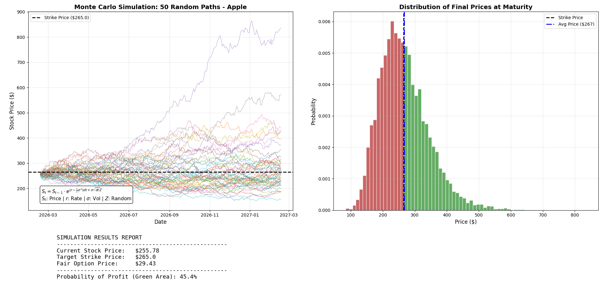

# Monte Carlo Simulation: European Call Option Valuation


## 📊 Project Overview
This project implements a **Monte Carlo Valuation Engine** to determine the "fair value" of a European Call Option for Apple Inc. (AAPL).

By simulating **10,000 future price paths** using Geometric Brownian Motion (GBM), the engine calculates the probability of the option expiring In-The-Money (ITM) and visualizes the risk distribution.

### 🎯 Objective
To value a Call Option with the following market parameters (Data as of Feb 17, 2026):
* **Asset:** Apple Stock (AAPL)
* **Current Price ($S_0$):** $255.78
* **Strike Price ($K$):** $265.00 (Out-of-the-Money)
* **Time to Maturity ($T$):** 1 Year
* **Volatility ($\sigma$):** 28% (Based on historical annualized standard deviation)

## 🧮 Mathematical Model
The simulation relies on **Geometric Brownian Motion (GBM)**, which models the stock price path as a stochastic process. The discrete-time formula used for the simulation path is:

$$S_{t} = S_{t-1} \cdot e^{(r - \frac{1}{2}\sigma^2)dt + \sigma\sqrt{dt}Z}$$

Where:
* $r$ = Risk-free rate (4.1%)
* $\sigma$ = Volatility (28%)
* $dt$ = Time step (1 day)
* $Z$ = Random sample from standard normal distribution $\mathcal{N}(0,1)$

## 📈 Visual Output
The script generates a dashboard containing:
1. **Monte Carlo Paths:** A visualization of 50 random potential future price trajectories.
2. **Distribution Histogram:** A frequency analysis of final stock prices at maturity, color-coded for Profit (Green) vs. Loss (Red).


*(Note: Ensure you save your output image in an 'assets' folder as simulation_result.png)*

## 🚀 Installation & Usage

### 1. Clone the repository
```bash
git clone [https://github.com/YourUsername/Monte-Carlo-Option-Pricer.git](https://github.com/YourUsername/Monte-Carlo-Option-Pricer.git)
cd Monte-Carlo-Option-Pricer

### 2. Install Dependencies
pip install -r requirements.txt

### 3. Run the Simulation 
 python Monte_Carlo_Valuation.py


### 📋 Simulation Parameters

| Parameter | Value | Description |
| :--- | :--- | :--- |
| **Simulations** | 10,000 | Number of random paths generated |
| **Steps** | 252 | Trading days in a year |
| **Risk-Free Rate** | 4.1% | Based on 1-Year US T-Bills (Discounted to Present Value) |
| **Volatility ($\sigma$)** | 28% | Annualized standard deviation (Historical: 20-35%) |
| **Strike Price ($K$)** | $265.00 | Out-of-the-Money (OTM) Target |
