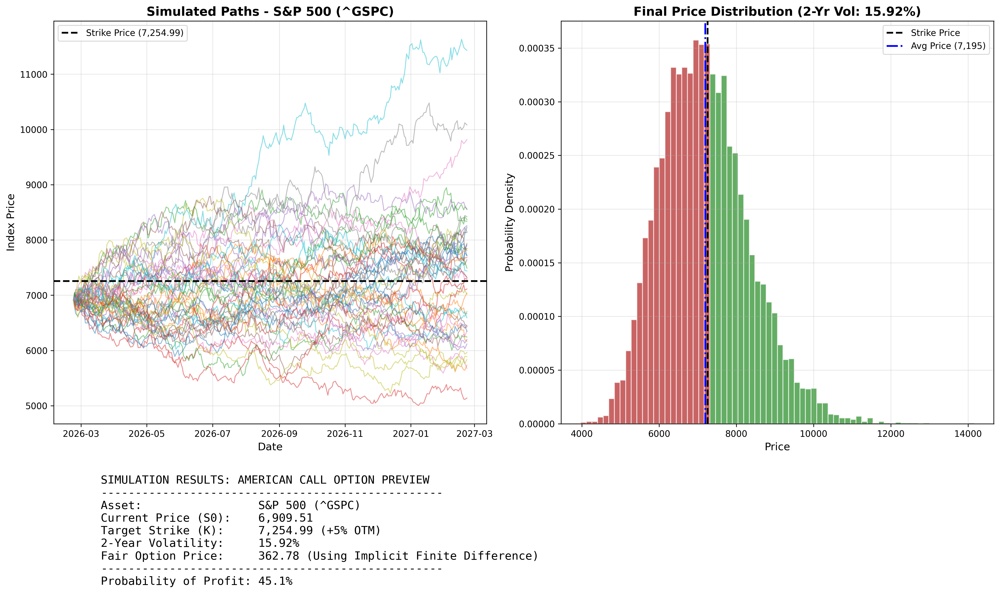
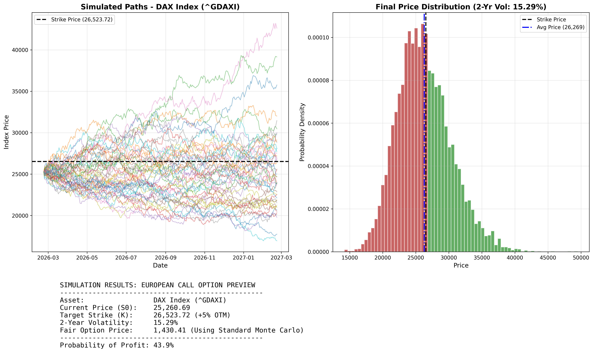
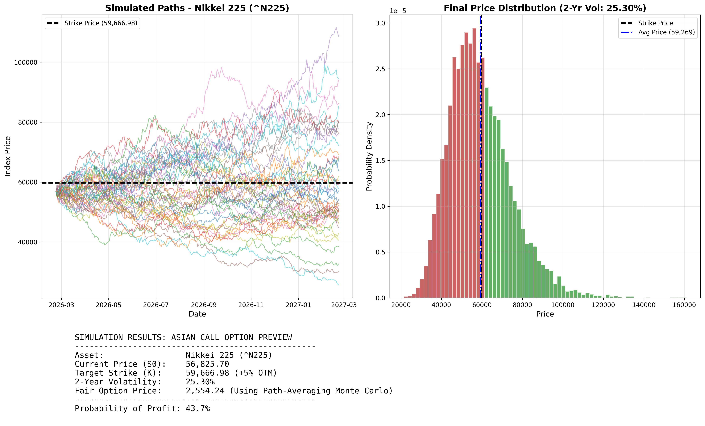
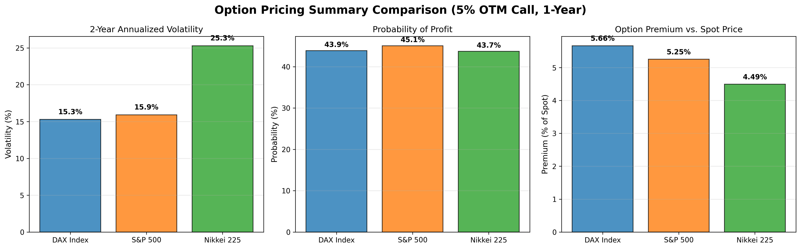

# Multi-Algorithmic Simulation of Derivative Structures and Valuation of Index Options

> Open-source quantitative finance project focused on numerical option pricing  
> and stochastic simulation methods.

---

### 🧠 Made For

Built as an independent open-source quantitative finance project driven by research interest in derivative pricing, stochastic processes, and numerical methods.

## 📊 Project Overview
In This project I implements a Python-based **quantitative pricing simulation** for valuing Call and Put Options. It applies advanced **numerical algorithms (Monte Carlo, FDM)** to evaluate and compare the characteristics of different **option styles (European, American, Asian)** across **major global equity indices (Dax, S&P500, Nikkei 225)**.

The engine dynamically fetches the last 2 years of trading data via yfinance to calculate historical **volatility**, simulates **future price paths**, calculates the **Probability of Profit (POP)**, and determines the **theoretical  "fair value"** of the options using the appropriate mathematical models.

---

## 🏗 Architecture

The pricing engine follows the Layers:

### • Data Layer
- Fetches historical market data using `yfinance`
- Computes log returns and annualized volatility
- Defines strike price (5% OTM) dynamically from spot
- Sets model inputs (r, σ, T, q)

### • Simulation Layer
- Generates stochastic price paths using Geometric Brownian Motion (GBM)
- Produces 10,000 Monte Carlo trajectories
- Handles path-dependent averaging for Asian options
- Computes terminal price distributions and Probability of Profit (POP)

### • Pricing Layer
- European options: Monte Carlo valuation under risk-neutral measure  
- Asian options: Path-averaged Monte Carlo pricing  
- American options: Implicit Finite Difference Method (FDM) solving the Black–Scholes PDE backward in time  
- Incorporates early-exercise comparison at each grid node

### • Visualization Layer
- Generates asset-specific dashboards (path simulations + histograms)
- Creates cross-index comparison bar charts
- Automatically exports figures to the `/assets` directory
- Highlights Profit vs. Loss regions visually

---

## 📌 Model Assumptions

The simulation framework relies on the classical Black–Scholes modeling assumptions:

- **Constant Volatility (σ)** estimated from historical returns
- **Constant Risk-Free Interest Rate (r)** over the option lifetime
- **Geometric Brownian Motion (GBM)** governs underlying price dynamics
- **Continuous trading and frictionless markets**
- **No transaction costs or liquidity constraints**
- **Dividend yield (q) assumed constant**

These assumptions allow numerical stability and comparability across pricing methods.

---

## ⚠ Limitations

While the framework captures core pricing mechanics, several real-world complexities are abstracted:

- Historical volatility is used instead of implied volatility
- No stochastic volatility modeling (e.g., Heston framework)
- No volatility skew calibration
- American early-exercise feature modeled solely via Implicit FDM
- Market microstructure effects and transaction costs are excluded

## 🌍 Supported Option Styles & Indices
* **European Option (DAX Index):** Standard exercise strictly at expiration. Valued using Standard Monte Carlo simulation.
* **American Option (S&P 500):** Features an early-exercise premium. Valued using the unconditionally stable Implicit Finite Difference Method (FDM).
* **Asian Option (Nikkei 225):** Path-dependent payoff based on the average price over the option's life. Valued using Path-Averaging Monte Carlo simulation.

## 🧮 Mathematical Model

### 1. **Geometric Brownian Motion (GBM)** 
is used to calculate the **Probability of Profit** across all models as a stoachastic process. The asset price paths are simulated for **10,000 future price paths**.
The discrete-time formula used is:

$$S_{t} = S_{t-1} \cdot e^{(r - \frac{1}{2}\sigma^2)dt + \sigma\sqrt{dt}Z}$$

Where:
* $r$ = Risk-free rate (4.1%) - US Bonds
* $\sigma$ = Annualized Volatility - Determined for past 2 Years
* $dt$ = Time step (1 day)
* $Z$ = Random sample from standard normal distribution $\mathcal{N}(0,1)$

## 2. Implicit Finite Difference Method (FDM)

To capture the **early-exercise premium** of **American options**, the engine solves the **Black–Scholes PDE with dividends** on a discrete **time–price grid** and steps **backward from maturity to today** using an **implicit finite difference scheme**:

$$
\frac{\partial V}{\partial t}
+\frac{1}{2}\sigma^{2}S^{2}\frac{\partial^{2}V}{\partial S^{2}}
+(r-q)S\frac{\partial V}{\partial S}
-rV = 0
$$

### Discretization and Grid Setup

- The price domain is truncated at a sufficiently large upper bound:  
  $S_{\max} = 3S_0$
- A uniform grid is used with:
  - $M = 150$ price steps and $N = 1000$ time steps  
  - $\Delta t = T/N$, and $S_j = j\Delta S$

The implicit scheme forms a linear system at each time step:

$$
A \, V^{n+1} = V^{n}
$$

where $A$ is **tridiagonal**, making the method computationally efficient.

### Boundary Conditions

At each backward time step, boundary conditions are enforced:

**Call option:**

- $V(0,t) = 0$
- $V(S_{\max},t) \approx S_{\max} - K e^{-r(T-t)}$

**Put option:**

- $V(0,t) \approx K e^{-r(T-t)}$
- $V(S_{\max},t) = 0$

These conditions match the asymptotic behavior of the option value as $S \to 0$ and $S \to S_{\max}$.

### Tridiagonal System Solution

The discretization produces a **banded tridiagonal matrix**, which is solved each step using a stable banded linear solver (e.g., `solve_banded`). This results in **unconditional stability**, allowing fine time resolution ($N=1000$) without numerical blow-up.

### American Early-Exercise Constraint

After solving the PDE step, the engine applies the American constraint via a pointwise projection:

$$
V(S,t) = \max\left(V(S,t), \text{Intrinsic}(S)\right)
$$

with:

- Call intrinsic value: $\max(S-K,0)$
- Put intrinsic value: $\max(K-S,0)$

A constant dividend yield $q = 1.5\%$ is included to make early-exercise behavior observable in the American framework.

## Visual Output

The script generates visualizations of the Distributions and Key Metrics saved directly to an **`/assets`** directory:

1. **Individual Asset Dashboards**  
   A two-panel plot for each index displaying:
   - **50 random potential future price trajectories**, and  
   - a **frequency distribution histogram of final prices** (color-coded for **Profit vs. Loss**).

2. **Global Summary Comparison**  
   A side-by-side bar chart comparing:
   - **Annualized Volatility**
   - **Probability of Profit**
   - **Relative Premium** across all **three global indices**.

   ## 📋 Simulation Parameters

| Parameter              | Value        | Description |
|------------------------|-------------|-------------|
| **Simulations**        | 10,000      | Number of random paths generated for Monte Carlo methods |
| **Time Steps (N)**     | 252 / 1000  | 252 trading days for Monte Carlo; 1000 steps for FDM accuracy |
| **Price Steps (M)**    | 150         | Grid granularity for the Finite Difference Method |
| **Risk-Free Rate (r)** | 4.1%        | Based on approximate 1-Year US Treasury Yields |
| **Volatility (σ)**     | Dynamic     | Calculated as the annualized standard deviation of the last 3 years |
| **Strike Price (K)**   | Dynamic     | Automatically set to 5% Out-of-the-Money (OTM) based on spot price |
| **Dividend Yield (q)** | 1.5%        | Used specifically to trigger early-exercise in American models |

## 📊 Results

### 🇺🇸 American Call — S&P 500

**Interpretation:**  
The simulated price paths show moderate dispersion around the strike (5% OTM).  
The distribution indicates a balanced upside tail with a ~45% probability of profit.  
The option value reflects early-exercise flexibility captured via the Implicit FDM.

---

### 🇩🇪 European Call — DAX Index

**Interpretation:**  
Lower volatility results in tighter price dispersion compared to Nikkei.  
Since the option is European-style, valuation is based purely on terminal payoff.  
Premium remains moderate relative to spot due to controlled volatility.

---

### 🇯🇵 Asian Call — Nikkei 225

**Interpretation:**  
Higher volatility (≈25%) leads to wider path dispersion and fatter tails.  
Path-averaging reduces extreme payoff effects, stabilizing the option price.  
Despite high volatility, probability of profit remains close to 44%.

---

### 🌍 Global Summary Comparison

**Interpretation:**  
Nikkei shows the highest volatility and widest price distribution.  
S&P 500 delivers the highest probability of profit (~45%).  
DAX commands the highest relative premium vs. spot, reflecting pricing differences across models and volatility regimes.

## 🧪 Future Improvements

While the current framework provides a robust numerical pricing engine under classical Black–Scholes assumptions, extensions are planned to enhance realism, computational efficiency, and quantitative depth.

### 🔹 Advanced Stochastic Modeling
- **Heston Stochastic Volatility Model** to relax the constant volatility assumption  
- Incorporation of **volatility mean reversion dynamics**
- Extension toward local volatility or hybrid models

### 🔹 Market Calibration Enhancements
- Calibration to **Implied Volatility Surfaces** instead of historical volatility  
- Modeling of **volatility smile and skew**
- Term-structure consistent interest rate modeling

### 🔹 Risk Sensitivity Analysis
- Numerical computation of **Greeks (Δ, Γ, Θ, Vega, ρ)**  
- Sensitivity comparison across Monte Carlo and FDM methods  
- Stability and convergence diagnostics
